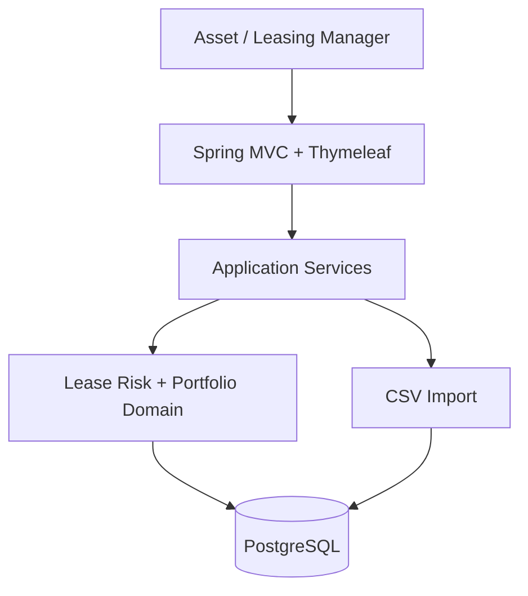

# LeaseGuard

An internal portfolio dashboard that turns a raw lease CSV into an explainable, prioritized
action list for commercial real estate leasing managers.

## Problem, target user, and why it matters

Commercial real estate asset and leasing managers track leases across many properties using
spreadsheets and disconnected systems. An expiration calendar alone doesn't answer the question
that actually matters: **which lease creates the greatest rental-income and negotiation-timeline
risk, and what should happen about it first?** LeaseGuard imports a synthetic lease portfolio,
computes a deterministic and explainable risk score for every lease, and gives the manager a
prioritized, filterable list with an audit trail of what's been done about each one.

Primary user: a Portfolio/Leasing Manager. Secondary: a Property/Portfolio Manager reviewing
exposure across a book of properties.

## What was built (MVP scope)

- CSV preview -> row-level validation -> atomic, idempotent import (upload or bundled demo data)
- Portfolio dashboard: total annual base rent, rent at risk, expiring-lease counts (90/180/365
  days), overdue renewal notices, unassigned leases, a risk-level chart, and the highest-risk
  leases
- Deterministic, explainable risk scoring with human-readable reason codes
- Filterable, paginated lease list (property, city, status, manager, expiration window, risk
  level)
- Lease detail with manager assignment, workflow status updates, and an append-only action
  history (audit trail), protected by optimistic locking
- Actuator health endpoint

**Explicit non-goals** (see `docs/product-brief.md` for the full list): no PDF/OCR extraction, no
ML-based scoring, no real email/SMS delivery, no authentication/authorization, no external
CRE/market-data APIs, no microservices, no lease accounting/CAM reconciliation, no production
multi-tenancy.

## Architecture summary

Server-rendered modular monolith: one Spring Boot application, one PostgreSQL database.



See `docs/architecture.md` for the full decision record (why a monolith, why atomic import, why
explainable rules instead of ML, why PostgreSQL, why an injected `Clock`, why optimistic
locking) and `docs/assumptions-and-tradeoffs.md` for narrower implementation-level judgment calls.

## Technology choices

| Concern | Choice | Why |
|---|---|---|
| Language/runtime | Java 21 | Required LTS baseline |
| Framework | Spring Boot 3.5.3 | Current stable line verified against Maven Central at build time; Java 21-compatible |
| Web/views | Spring MVC + Thymeleaf | Server-rendered; no separate frontend build/deploy |
| Data access | Spring Data JPA + Hibernate | Standard, well-understood; schema is Flyway-owned, Hibernate only validates |
| Database | PostgreSQL 16.4 (Docker) | Real constraints, money precision, Testcontainers parity with prod |
| Migrations | Flyway | Explicit, versioned, `ddl-auto=validate` only |
| CSV parsing | Apache Commons CSV | Small, standard library; avoids hand-rolled quoting/escaping bugs |
| UI assets | Bootstrap 5 + Chart.js via WebJars | Self-contained image; no CDN dependency at runtime |
| Testing | JUnit 5, Mockito, Testcontainers | Real PostgreSQL behavior in integration tests, not an H2 stand-in |
| Build | Maven + Maven Wrapper | No global Maven install required |

## Repository structure

```text
.
├── data/demo/                       Valid and invalid synthetic CSVs
├── docs/                            Product brief, architecture, data dictionary, and this file's companions
├── src/main/java/com/leaseguard/    Package-by-layer (see docs/assumptions-and-tradeoffs.md)
│   ├── controller/                  Spring MVC @Controller classes (one per screen/feature)
│   ├── service/                     Business logic - risk scoring, CSV import, dashboard, lease actions
│   ├── repository/                  Spring Data JPA repositories and query-building helpers
│   ├── model/                       JPA @Entity classes and their persisted-column enums
│   ├── dto/                         View models, filter objects, and computed (non-persisted) types
│   ├── exception/                   Custom exceptions and the global @ControllerAdvice handler
│   └── config/                      Clock/risk-threshold config, correlation ID filter
├── src/main/resources/
│   ├── db/migration/                Flyway migrations (V1__create_core_schema.sql, ...)
│   ├── templates/                   Thymeleaf views
│   └── application.yml
├── src/test/java/com/leaseguard/    Unit tests, Testcontainers *IT tests, MockMvc web tests
├── compose.yaml, Dockerfile, .env.example
└── pom.xml
```

## Prerequisites

- **Docker-only workflow:** Docker Desktop (or compatible engine) with Compose v2. Nothing else.
- **IDE/Maven workflow:** Java 21, and either the bundled Maven Wrapper (`./mvnw`, no global
  Maven needed) or Maven 3.9+ installed yourself. Docker is still needed to run PostgreSQL
  locally and to run the Testcontainers integration tests.

## Running it

### Full containerized application

```bash
docker compose up --build
```

Starts PostgreSQL (with a health check) and the application (waits for PostgreSQL to be
healthy). App: http://localhost:8080/dashboard. Actuator health:
http://localhost:8080/actuator/health.

### IDE/Maven development loop (PostgreSQL in Docker, app from your IDE or Maven)

```bash
docker compose up -d postgres
./mvnw spring-boot:run
```

`application.yml` defaults (`DB_HOST=localhost`, etc.) already point at the Dockerized Postgres
above with no extra configuration needed.

### Run tests

```bash
./mvnw test
```

Runs unit tests, Testcontainers-backed PostgreSQL integration tests, and MockMvc web tests in one
command (Surefire is configured to also pick up `*IT.java` classes - see
`docs/assumptions-and-tradeoffs.md`). Requires Docker to be running for the integration tests.

### View logs

```bash
docker compose logs -f app
docker compose logs -f postgres
```

### Stop while preserving data

```bash
docker compose down
```

### Explicitly reset the database (destructive, intentional)

```bash
docker compose down -v
```

## URLs

- Application: http://localhost:8080/dashboard
- Actuator health: http://localhost:8080/actuator/health

(No Swagger/OpenAPI endpoint - see `docs/assumptions-and-tradeoffs.md` for why a REST API surface
wasn't added to this server-rendered application.)

## Database creation and Flyway behavior

The database starts **schema-only**. On first startup, Flyway applies
`V1__create_core_schema.sql`, creating `properties`, `tenants`, `leases`, `lease_actions`, and
`import_batches`, and records the applied version in `flyway_schema_history`. Restarting the
application (or the containers) never recreates or drops tables - Flyway sees the migration is
already applied and does nothing further; Hibernate is configured with
`spring.jpa.hibernate.ddl-auto=validate`, so it only checks that entity mappings agree with the
actual schema and never generates DDL itself. Every future schema change ships as a new
immutable migration (`V2__...`), never an edit to `V1`.

## Importing data

1. Go to **Import Data**.
2. Either upload a CSV or click **Load bundled demo data** (uses `data/demo/lease_portfolio.csv`
   through the identical validation/import path as a manual upload).
3. Review the preview: row counts by New/Changed/Unchanged/Warning/Error. Nothing is persisted
   yet.
4. If there are zero errors, click **Confirm Import** to commit atomically.

**Expected result for the valid demo CSV:** 30 rows, all New, 0 errors, committing to 8
properties, 30 tenants, and 30 leases. Reimporting the same file afterward shows 30 Unchanged, 0
New, 0 Changed - no duplicates are ever created. Reimporting with a row's
`property_external_id`/`tenant_external_id` changed (but everything else the same) shows that row
as Changed and reassigns the existing lease to the new property/tenant, rather than silently
keeping the old association.

Maximum file size is 5MB end to end - both the initial upload and the commit step (which
re-submits the previewed content as a plain form field, not multipart) accept the same limit, so
a file that previews successfully will not be rejected purely on size when committed.

## Trying the invalid CSV

Upload `data/demo/lease_portfolio_invalid.csv`. It demonstrates: an end-date before the start
date, negative annual rent, leased square footage exceeding the property's total, an invalid
`property_type` enum value, a duplicate `lease_external_id` within the file, and a missing
required field. The preview shows a per-row, per-field error for each, there is no commit option,
and no property/tenant/lease rows are written - this was verified directly against the running
application, not just asserted.

## Demo "as of" date

Risk scoring treats `leaseguard.demo.as-of-date` (default `2026-08-17`, matching the synthetic
data) as "today," injected everywhere via a fixed `Clock` bean so results are fully
deterministic. Override it via the `DEMO_AS_OF_DATE` environment variable (see `.env.example`). A
production profile would instead bind a real system clock.

## Risk-scoring rules and why they're explainable

Deterministic point-based rules, evaluated per lease against the configured as-of date:

| Rule | Points |
|---|---|
| Lease already expired, not marked renewed | +50 |
| Expires in 0-90 days | +40 |
| Expires in 91-180 days | +25 |
| Expires in 181-365 days | +10 |
| Renewal-notice deadline passed, not marked renewed | +35 |
| Annual base rent at/above the high-rent threshold (default $1,000,000) | +15 |
| Tenant is >= the concentration threshold of the property's rent (default 25%) | +10 |
| No manager assigned | +10 |
| Status is `RENEWAL_IN_PROGRESS` | -20 |
| Status is `RENEWED` | forced to exactly 0, no other reasons |

Risk levels: HIGH 70+, MEDIUM 40-69, LOW 1-39, NONE 0. Every non-zero score returns the ordered
list of reason codes that produced it - visible on the lease detail page - so a manager can see
*why* a lease is prioritized, not just that it is. See `docs/interview-defense.md` for the full
boundary-semantics discussion and a real bug/fix found while building this (duplicate-ID
detection).

## Assumptions, limitations, and security boundary

This is a trusted local/internal demonstration with no authentication, authorization, or tenant
isolation - see `docs/architecture.md`'s security-boundary section for what a production version
would require. Key implementation judgment calls (property vs. tenant conflict policy, why risk
scoring is computed on read, why filtering by risk level happens in memory) are recorded in
`docs/assumptions-and-tradeoffs.md` with reasoning, not just stated.

## Test strategy and verified commands

Unit tests cover every risk-scoring rule at its exact day boundary (expired, 0, 90, 91, 180, 181,
365, 366), combined rules, the `RENEWED` short-circuit, the zero floor, CSV field validation, and
lease idempotency comparison logic (including property/tenant reassignment on reimport, not just
the scalar fields). Testcontainers integration tests (real PostgreSQL) cover Flyway migration
application, unique/foreign-key/check constraints, atomic import, idempotent reimport,
all-or-nothing rollback on an invalid batch, update-on-reimport (including property/tenant
reassignment), optimistic-lock conflicts (both the pre-check for a stale page and a true
simultaneous double-submit, which surface a consistent conflict message rather than a generic
500), the expiring-within-N-days lease-list filter at its boundaries (already-expired leases
excluded, the exact cutoff day included), and dashboard aggregate/filter queries verified against
independently computed expected values. MockMvc tests cover dashboard rendering, upload
validation responses, filter parameters, Post/Redirect/Get on form submissions, and 404/conflict
handling.

Verified locally before writing this section:

```text
$ ./mvnw test
...
Tests run: 81, Failures: 0, Errors: 0, Skipped: 0
BUILD SUCCESS
```

```text
$ docker compose config          # succeeds
$ docker compose up --build      # PostgreSQL healthy, app healthy, Flyway applies V1 on first run
$ docker compose down            # data preserved across restart (verified: same 30 leases after `up` again)
$ docker compose down -v         # explicit reset, verified schema-only on next `up`
```

Dashboard KPIs were independently cross-checked: a standalone script computed total annual base
rent, unassigned-lease count, and 90/180/365-day expiring counts directly from
`data/demo/lease_portfolio.csv` and matched the running application's dashboard exactly.

## Troubleshooting

- **Port already in use (5432 or 8080):** set `POSTGRES_PORT` / `SERVER_PORT` in a local `.env`
  (copy `.env.example`) to a free port, or stop whatever else is bound to it.
- **PostgreSQL unhealthy / app won't start:** `docker compose logs postgres` - most often a stale
  volume from a previous incompatible schema attempt; `docker compose down -v` and retry.
- **Clean rebuild:** `docker compose down -v && docker compose build --no-cache && docker compose up`.
- **Testcontainers/Docker issues running `./mvnw test`:** confirm `docker info` succeeds first.
  If Docker Desktop was just started, give it a few seconds. On some Docker Desktop installations
  the bundled Testcontainers client negotiates an outdated Docker API version against a very new
  daemon; this repository pins a modern API version via a Surefire system property in `pom.xml`
  so this should not require any manual environment configuration.

## Future roadmap

See `docs/future-roadmap.md`, ordered by business value with explicit triggers for when each item
would become worth building (authentication/multi-tenancy, precomputed risk scores at scale,
staged import for large files, real notification delivery, market-data integration, lease
accounting, multi-source reconciliation, import-error history, a read-only REST API).

## AI usage disclosure

This project was built with Claude as an active development collaborator, with explicit
permission per `CLAUDE.md`. See `AI_USAGE.md` for a specific account of what was AI-generated,
what was independently verified (dependency versions, test results, dashboard math), and what a
human should still double-check before any production use.
