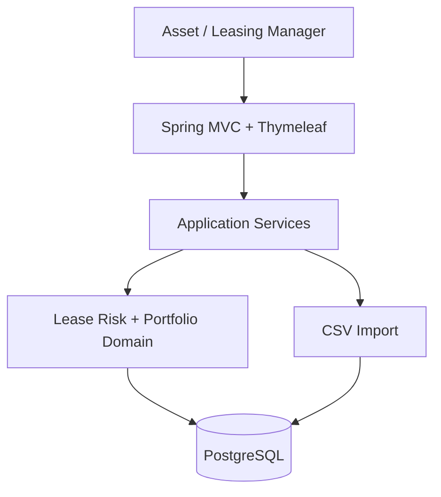

# LeaseGuard Architecture Direction

## Decision

Use a server-rendered modular monolith. For an internal workflow MVP, it provides one deployment unit, straightforward transactions, and fast delivery. Domain boundaries remain explicit so capabilities can be separated later if evidence justifies it.



## Primary flows

### CSV import

Upload → checksum/format validation → row parsing → business validation → preview/error report → approved atomic import → normalized records → dashboard refresh.

### Risk calculation

Lease + property portfolio context + configurable as-of date + thresholds → deterministic rules → score + risk level + reason codes.

### Action update

Validated command → optimistic-lock check → lease status/owner update → append LeaseAction → recalculate priority.

## Key decisions

1. **Combined denormalized CSV:** Easy for users to exchange; normalization into the relational database remains the application's responsibility.
2. **Atomic import:** Predictable for the MVP data size and prevents an invalid batch from producing a partial portfolio. Staging/chunking is future work for large production imports.
3. **Explainable rules instead of ML:** No historical labeled outcomes are available, and business users must understand the reason for a priority.
4. **Thymeleaf instead of an SPA:** A separate frontend build and deployment adds complexity without improving this internal MVP's core outcome.
5. **PostgreSQL instead of only an in-memory database:** Demonstrates realistic constraints, monetary data integrity, and persistence. Testcontainers provides production-like integration tests.
6. **Injected Clock:** Makes date-driven behavior and boundary tests deterministic.
7. **Optimistic locking:** Detects conflicting manager updates without holding long database locks.

## PostgreSQL and schema lifecycle

Docker Compose runs PostgreSQL with a named persistent volume and health check. Flyway owns schema creation and applies each versioned migration once. Hibernate uses schema validation only. Normal application startup never drops tables, recreates the schema, or reloads demo data.

The initial startup sequence is:

```text
PostgreSQL container starts
→ PostgreSQL health check passes
→ Spring Boot starts
→ Flyway applies missing migrations
→ Hibernate validates mappings
→ Application becomes ready with an empty portfolio
```

Demo data is loaded through an explicit CSV import using the same validation and import path available to the user. Reimport is idempotent. Docker Compose restarts preserve data; removing the named volume is the explicit local reset operation.

## Security boundary

The MVP is a trusted local/internal demonstration. A production version would require OIDC/SSO, role-based access, tenant isolation, encrypted transport, secure object storage, malware scanning, import-size limits, and audit-retention policies. Do not build fake authentication merely for appearance.

## Scale discussion

The MVP may use synchronous import and on-read risk calculation. Measurable future triggers include:

- Move to staged asynchronous processing when import latency exceeds the accepted user wait time.
- Consider precomputed/materialized risk views at hundreds of thousands of leases or when profiling shows repeated calculation is a bottleneck.
- Add caching only after read-volume profiling demonstrates a need.
- Use a durable outbox and worker when real notification delivery becomes a requirement.
- Add canonical integration contracts and reconciliation when multiple source systems are introduced.

Do not implement these future choices in the MVP.
