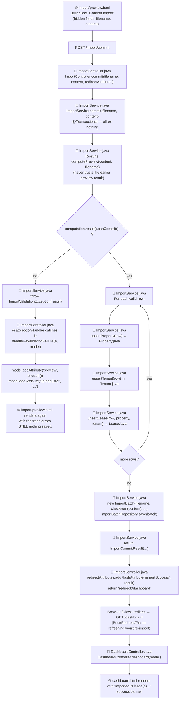
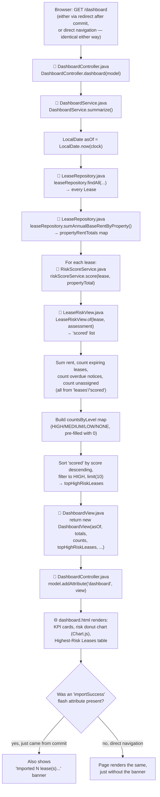
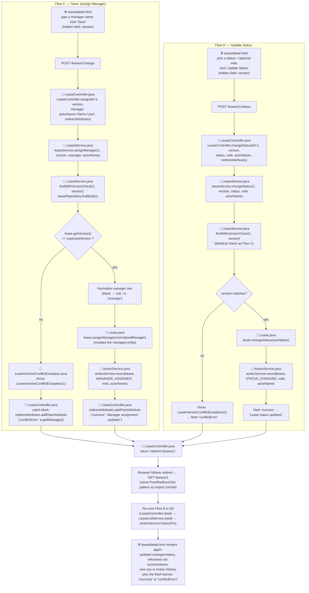

# Code Flow: Import Preview

Two different starting points — a manual CSV upload, and the bundled demo-data button —
that both end up running through the exact same validation pipeline. This is deliberate: per
`CLAUDE.md`, the bundled demo-data action must reuse the same validation/import path as a real
upload, not a separate hidden seeding implementation. The diagram below shows exactly where they
diverge and where they reconverge. Every node names the file and method it belongs to.

Open this file's preview in VS Code (or view it on GitHub) to render the diagram.

## Files involved

| Short name | Full path |
|---|---|
| `ImportController.java` | [src/main/java/com/leaseguard/controller/ImportController.java](../src/main/java/com/leaseguard/controller/ImportController.java) |
| `ImportService.java` | [src/main/java/com/leaseguard/service/ImportService.java](../src/main/java/com/leaseguard/service/ImportService.java) |
| `LeaseCsvReader.java` | [src/main/java/com/leaseguard/service/LeaseCsvReader.java](../src/main/java/com/leaseguard/service/LeaseCsvReader.java) |
| `CsvRowValidator.java` | [src/main/java/com/leaseguard/service/CsvRowValidator.java](../src/main/java/com/leaseguard/service/CsvRowValidator.java) |
| `PropertyRepository.java` | [src/main/java/com/leaseguard/repository/PropertyRepository.java](../src/main/java/com/leaseguard/repository/PropertyRepository.java) |
| `TenantRepository.java` | [src/main/java/com/leaseguard/repository/TenantRepository.java](../src/main/java/com/leaseguard/repository/TenantRepository.java) |
| `LeaseRepository.java` | [src/main/java/com/leaseguard/repository/LeaseRepository.java](../src/main/java/com/leaseguard/repository/LeaseRepository.java) |
| `ImportPreviewResult.java` | [src/main/java/com/leaseguard/dto/ImportPreviewResult.java](../src/main/java/com/leaseguard/dto/ImportPreviewResult.java) |
| `import/form.html` | [src/main/resources/templates/import/form.html](../src/main/resources/templates/import/form.html) |
| `import/preview.html` | [src/main/resources/templates/import/preview.html](../src/main/resources/templates/import/preview.html) |

```mermaid
flowchart TD
    subgraph S1["Scenario 1 — Manual file upload"]
        A1["🌐 import/form.html\nuser picks a CSV file,\nclicks 'Preview Import'"] --> A2["POST /import/preview\n(multipart/form-data, field 'file')"]
        A2 --> A3["📄 ImportController.java\nImportController.preview(file, model)"]
        A3 --> A4{"file.isEmpty() ?"}
        A4 -->|yes| A5["📄 ImportController.java\nmodel.uploadError = '...'\nreturn 'import/form'"]
        A4 -->|no| A7["📄 ImportController.java\ncontent = new String(file.getBytes(), UTF_8)"]
        A7 --> A8["📄 ImportController.java\ncalls importService.previewUpload(filename, content)"]
    end

    subgraph S2["Scenario 2 — Load bundled demo data"]
        B1["🌐 import/form.html\nuser clicks\n'Preview Bundled Demo Data'"] --> B2["POST /import/preview-demo\n(no body)"]
        B2 --> B3["📄 ImportController.java\nImportController.previewBundledDemoData(model)"]
        B3 --> B4["📄 ImportController.java\ncalls importService.previewBundledDemoData()"]
        B4 --> B5["📄 ImportService.java\nImportService.previewBundledDemoData()\nFileSystemResource(bundledCsvPath)\n.getContentAsString(UTF_8)\n→ reads data/demo/lease_portfolio.csv off disk"]
        B5 --> B6["content = file text"]
    end

    A8 --> C0
    B6 --> C0

    C0["📄 ImportService.java\nImportService.computePreview(content, filename)\n(private method — the shared entry point)"]
    C0 --> C1

    subgraph SHARED["Shared pipeline inside computePreview(...)"]
        C1["📄 LeaseCsvReader.java\nLeaseCsvReader.read(new StringReader(content))"] --> C2{"Required headers present\n&amp; file parses OK ?"}
        C2 -->|no| C3["📄 LeaseCsvReader.java\nthrow ImportFileFormatException"]
        C3 --> C4["📄 ImportPreviewResult.java\nImportPreviewResult.fileError(filename, message)"]

        C2 -->|yes| C5["List&lt;RawCsvRow&gt; rawRows"]
        C5 --> C6["📄 CsvRowValidator.java\nFor each row: CsvRowValidator.validate(row, asOf)"]
        C6 --> C7["List&lt;RowValidationResult&gt;\n(per-row field errors, or a ParsedLeaseRow)"]

        C7 --> C8["📄 ImportService.java\nImportService.detectDuplicateLeaseIds(rawRows)\n→ same lease_external_id twice in file?"]
        C8 --> C9["📄 ImportService.java\nImportService.detectPropertyConflicts(validations)\n→ queries PropertyRepository.java"]
        C9 --> C10["📄 ImportService.java\nImportService.detectTenantConflicts(validations)\n→ queries TenantRepository.java, adds WARNINGs"]

        C10 --> C11["📄 ImportService.java\nFor each row: combine\nfield errors + batch-level issues"]
        C11 --> C12{"row has an ERROR issue?"}
        C12 -->|yes| C13["RowStatus.ERROR"]
        C12 -->|no| C14{"row has a WARNING issue?"}
        C14 -->|yes| C15["RowStatus.WARNING\n(still counted as importable)"]
        C14 -->|no| C16["📄 ImportService.java\nImportService.classifyIdempotency(row)\n→ queries LeaseRepository.findByExternalId(...)"]
        C16 --> C17["NEW / CHANGED / UNCHANGED"]

        C13 --> C18["Build RowOutcome for this row"]
        C15 --> C18
        C17 --> C18
        C18 --> C19["📄 ImportService.java\ncanCommit = (errorCount == 0)\ncontent is kept in the result\nonly if canCommit"]
        C19 --> C20["📄 ImportPreviewResult.java\nreturn new ImportPreviewResult(...)"]
    end

    C4 --> D1
    C20 --> D1

    D1["📄 ImportController.java\nBack in preview(...) / previewBundledDemoData(...):\nmodel.addAttribute('preview', result)"] --> D2["📄 ImportController.java\nreturn 'import/preview'"]
    D2 --> D3["🌐 import/preview.html\nrenders row counts, per-row status table,\nand (if canCommit) a Confirm Import form\nwith hidden filename + content fields"]
    D3 --> D4["Browser shows the preview page.\nNOTHING has been saved to the database yet."]
```

## Key takeaway

Both scenarios are just two different ways of producing `content` (the raw CSV text) and
`filename`, both living in `ImportController.java`. From the moment
`ImportService.computePreview(...)` is called, the code path is **100% identical** — same parser
(`LeaseCsvReader.java`), same field validation (`CsvRowValidator.java`), same duplicate/conflict
checks, same idempotency check against the database (`LeaseRepository.java`). Nothing is written
to the database in either scenario; this is preview only. Committing (`POST /import/commit`) is
the next step, diagrammed below.

# Code Flow: Confirm Import (commit)

What happens when the user clicks **Confirm Import** on the preview page — the step that
actually writes to the database. `import/preview.html`'s commit form carries the exact CSV
content back as a hidden field, so the server holds no state between preview and commit (see
`docs/assumptions-and-tradeoffs.md` for why).

## Additional files involved

| Short name | Full path |
|---|---|
| `Property.java` | [src/main/java/com/leaseguard/model/Property.java](../src/main/java/com/leaseguard/model/Property.java) |
| `Tenant.java` | [src/main/java/com/leaseguard/model/Tenant.java](../src/main/java/com/leaseguard/model/Tenant.java) |
| `Lease.java` | [src/main/java/com/leaseguard/model/Lease.java](../src/main/java/com/leaseguard/model/Lease.java) |
| `ImportBatch.java` | [src/main/java/com/leaseguard/model/ImportBatch.java](../src/main/java/com/leaseguard/model/ImportBatch.java) |
| `ImportBatchRepository.java` | [src/main/java/com/leaseguard/repository/ImportBatchRepository.java](../src/main/java/com/leaseguard/repository/ImportBatchRepository.java) |
| `ImportValidationException.java` | [src/main/java/com/leaseguard/exception/ImportValidationException.java](../src/main/java/com/leaseguard/exception/ImportValidationException.java) |
| `DashboardController.java` | [src/main/java/com/leaseguard/controller/DashboardController.java](../src/main/java/com/leaseguard/controller/DashboardController.java) |
| `dashboard.html` | [src/main/resources/templates/dashboard.html](../src/main/resources/templates/dashboard.html) |

## Key takeaway

`commit()` is deliberately paranoid: it re-validates the actual file content one more time
before writing anything, rather than trusting that "canCommit was true a second ago." The entire
loop over rows plus the `ImportBatch` save happen inside one `@Transactional` boundary — if
anything threw partway through, the whole thing rolls back and nothing is left half-saved. The
redirect-to-dashboard-on-success step is what makes refreshing the browser after a successful
import safe (it just reloads the dashboard, it doesn't resubmit the form).

# Code Flow: Rendering the Dashboard

What happens on `GET /dashboard` — the request the browser makes after following the redirect
from a successful commit. **Important:** this is a brand-new, independent request. It does not
receive or reuse any data from the import that just happened — it recomputes everything from
scratch by querying the database as it stands right now, which simply happens to include the
rows the commit just wrote. This same flow runs identically if you navigate to `/dashboard`
directly, with no import involved at all.

## Additional files involved

| Short name | Full path |
|---|---|
| `DashboardService.java` | [src/main/java/com/leaseguard/service/DashboardService.java](../src/main/java/com/leaseguard/service/DashboardService.java) |
| `DashboardView.java` | [src/main/java/com/leaseguard/dto/DashboardView.java](../src/main/java/com/leaseguard/dto/DashboardView.java) |
| `RiskScoreService.java` | [src/main/java/com/leaseguard/service/RiskScoreService.java](../src/main/java/com/leaseguard/service/RiskScoreService.java) |
| `LeaseRiskView.java` | [src/main/java/com/leaseguard/dto/LeaseRiskView.java](../src/main/java/com/leaseguard/dto/LeaseRiskView.java) |

## Key takeaway

Notice `F1` has two different arrows feeding into it in spirit — a post-commit redirect, or a
plain direct visit — and from `F2` onward the flow is **completely identical** either way. The
only thing that differs is whether an `importSuccess` flash attribute happens to be sitting there
for `dashboard.html` to notice (step `F15`). Every number on the page (`F4` through `F12`) is
freshly computed from the database on every single request — there is no caching, no stored
dashboard state, nothing "pushed" from the import flow into this one. If you imported data,
waited an hour, and then loaded `/dashboard`, you'd see the exact same numbers as loading it one
second after the import — because both are just "ask the database what's true right now."

# Code Flow: "View all high-risk leases" and clicking a single lease

Two more starting points from the dashboard's "Highest-Risk Leases" panel — clicking the **"View
all high-risk leases"** link versus clicking one specific lease row (e.g. `LSE-1001`). Both land
in `LeaseController.java`, but at two different methods.

## Additional files involved

| Short name | Full path |
|---|---|
| `LeaseController.java` | [src/main/java/com/leaseguard/controller/LeaseController.java](../src/main/java/com/leaseguard/controller/LeaseController.java) |
| `LeaseListService.java` | [src/main/java/com/leaseguard/service/LeaseListService.java](../src/main/java/com/leaseguard/service/LeaseListService.java) |
| `LeaseSpecifications.java` | [src/main/java/com/leaseguard/repository/LeaseSpecifications.java](../src/main/java/com/leaseguard/repository/LeaseSpecifications.java) |
| `ActionService.java` | [src/main/java/com/leaseguard/service/ActionService.java](../src/main/java/com/leaseguard/service/ActionService.java) |
| `LeaseNotFoundException.java` | [src/main/java/com/leaseguard/exception/LeaseNotFoundException.java](../src/main/java/com/leaseguard/exception/LeaseNotFoundException.java) |
| `lease/list.html` | [src/main/resources/templates/lease/list.html](../src/main/resources/templates/lease/list.html) |
| `lease/detail.html` | [src/main/resources/templates/lease/detail.html](../src/main/resources/templates/lease/detail.html) |
| `error.html` | [src/main/resources/templates/error.html](../src/main/resources/templates/error.html) |

```mermaid
flowchart TD
    subgraph G1["Flow A — 'View all high-risk leases' link"]
        G1a["🌐 dashboard.html\nlink: /leases(riskLevel='HIGH')"] --> G1b["GET /leases?riskLevel=HIGH"]
        G1b --> G1c["📄 LeaseController.java\nLeaseController.list(riskLevel=HIGH,\nall other filters null, page=0, model)"]
        G1c --> G1d["Build LeaseFilters(null, null, null,\nnull, null, HIGH)"]
        G1d --> G1e["📄 LeaseListService.java\nleaseListService.list(filters, 0, 20)"]

        G1e --> G1f["📄 LeaseSpecifications.java\nfrom(filters, asOf) → SQL-level filter\n(none of the SQL-able fields are set here,\nso this query fetches every lease)"]
        G1f --> G1g["📄 LeaseRepository.java\nleaseRepository.findAll(spec)"]
        G1g --> G1h["Score every lease\n(same RiskScoreService as the dashboard)"]
        G1h --> G1i["Filter in-memory: keep only\nview.riskLevel() == HIGH\n(risk level can't be a SQL filter — it's computed)"]
        G1i --> G1j["Sort by score descending,\nslice out page 0 (first 20)"]
        G1j --> G1k["📄 LeaseController.java\nAlso loads dropdown data:\nproperties, cities, managers, statuses"]
        G1k --> G1l["🌐 lease/list.html renders:\nfilter form (Risk Level pre-set to HIGH),\npaginated table of matching leases"]
    end

    subgraph G2["Flow B — clicking one lease row, e.g. LSE-1001"]
        G2a["🌐 dashboard.html or lease/list.html\nlink: /leases/{id}"] --> G2b["GET /leases/1"]
        G2b --> G2c["📄 LeaseController.java\nLeaseController.detail(id=1, model)"]
        G2c --> G2d["📄 LeaseListService.java\nleaseListService.detail(1)"]

        G2d --> G2e["📄 LeaseRepository.java\nleaseRepository.findById(1)"]
        G2e --> G2f{"lease found?"}
        G2f -->|no| G2g["📄 LeaseNotFoundException.java\nthrow LeaseNotFoundException(1)"]
        G2g --> G2h["Caught by GlobalExceptionHandler\n→ 🌐 error.html renders a 404 page"]

        G2f -->|yes| G2i["Look up this lease's property's\ntotal rent (single value,\nnot the full map like the dashboard uses)"]
        G2i --> G2j["Score this one lease\n→ LeaseRiskView"]
        G2j --> G2k["📄 ActionService.java\nactionService.historyFor(1)\n→ ordered audit history"]
        G2k --> G2l["🌐 lease/detail.html renders:\nlease facts, 'Why this score?' reasons,\nassign-manager form, status form,\naction history table"]
    end
```

## Key takeaway

**Flow A** doesn't actually run any *new* logic — it's the exact same `LeaseListService.list(...)`
that backs the normal `/leases` filter page (covered nowhere else in this doc until now); the
link just pre-fills one query parameter (`riskLevel=HIGH`) so you land on the list already
filtered. As `LeaseListService.java`'s own Javadoc explains, risk level can't be pushed down into
the database query (it's computed, not a stored column), so it's applied as an in-memory filter
*after* scoring, then sorted and paginated in memory too — this is a deliberate, documented
trade-off for this MVP's scale, not an oversight.

**Flow B** is a single-lease version of the same scoring logic — score just one lease instead of
a whole list — plus one extra step neither other flow has: pulling that lease's audit history via
`ActionService`. It's also the one place in these diagrams where a "not found" branch actually
matters: if the ID in the URL doesn't exist, `LeaseNotFoundException` is thrown and the app shows
a proper 404 instead of a broken page — the same `error.html` used for any unmapped route.

# Code Flow: "Save" (assign manager) and "Update Status" buttons

What happens on the lease detail page when you fill in the **Assign Manager** form and click
**Save**, or pick a status and click **Update Status**. Both forms carry a hidden `version` field
(the lease's version at the moment the page was rendered) — this is the optimistic-locking check
covered earlier: if someone else changed the lease in between, the update is rejected with a
clear message instead of silently overwriting their change.

## Additional files involved

| Short name | Full path |
|---|---|
| `LeaseService.java` | [src/main/java/com/leaseguard/service/LeaseService.java](../src/main/java/com/leaseguard/service/LeaseService.java) |
| `LeaseVersionConflictException.java` | [src/main/java/com/leaseguard/exception/LeaseVersionConflictException.java](../src/main/java/com/leaseguard/exception/LeaseVersionConflictException.java) |

## Key takeaway

Both flows are the same shape: **check the version → mutate the `Lease` → record a `LeaseAction`
→ redirect**. Neither one directly returns a rendered page — they always redirect back to
`GET /leases/{id}`, which fully re-runs Flow B from scratch. That's *why* the risk score and "Why
this score?" reasons on the refreshed page can change after these actions: assigning a manager
removes the `NO_MANAGER_ASSIGNED` reason (-10 points), and changing status to
`RENEWAL_IN_PROGRESS` applies its -20 adjustment — the score isn't stored anywhere, so the next
`GET` simply computes a different answer now that the underlying `Lease` data is different. The
new `LeaseAction` row from `actionService.record(...)` is also why the previously-empty "Action
History" table gets its first entry.
